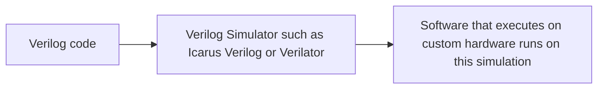
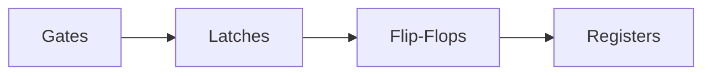

# Basics of Verilog

Verilog is a HDL (Hardware Description Language) used to describe electronic circuits using code.

<ins> Digital and Analog circuits </ins>

Digital circuits are a level of abstraction of analog circuits where all signals are taken  as either 0 or 1 with reference to a clock. In digital circuits, the input and the output are both logic levels. 

Synchronous logic : clock affects the input.
Asynchronous logic : clock does not affect input.

*What is clock ?*
*In digital circuits, clock is what drives each step in the circuit. Ultimately, the clock can be visualized as a square wave. Its value can be either 1 or 0 at an instant of time.*

HDLs like Verilog or VHDL (VHSIC Description language) at a fundamental level describe logical components like logic gates and flip flops in a circuit. 

Basic components of Verilog are :

    • Wire : Express a physical connection between two components. 
    • Register : Holds data 

*Combination circuits are a type of digital circuit where the output depends only on the input at that instant. In contrast, a sequential circuit is a digital circuit where the previous state of the machine becomes relevant. Hence, The need to remember values or state. This is where registers are required.*

<ins>Language semantics of Verilog</ins> 

    • Procedural Blocks: Describe the behavior of modules. They can be of two types :-
        ◦ Initial: Executes only once at the beginning of the simulation. 
        ◦ Always: Executes repeatedly on being triggered by events.  
      HDLs are inherently concurrent. Its concurancy is controlled by fork and join.

    • Module: The fundamental building block of a Verilog design.
      
    • Inter-statement delay: Delay between the execution of two statements.
      
    • Intra-statement delay: Delay within a single statement.
      
    • Delta Delay: Zero actual time. Used to models immediate hardware events.
      
    • Transport Delay: Time taken for signal propagation.
      
    • Inertial Delay: Filters out short glitches/pulses below a certain duration.
      
    • Test Bench Code: Code written specifically to verify the functional correctness and timing of the Design Under Test.
      
    • HDL Simulators: Software tools used to simulate the behavior of digital circuits.
      
    • Regression Environment: A structured methodology for running a wide range of test cases automatically.

    • Logic Synthesis: The process of converting RTL HDL code into a gate-level netlist using a technology library.
      
    • Subroutines: Reusable code blocks.
      
        ◦ Task: Consume simulation time (contain delays, wait).
        ◦ Function: Does not consume simulation time (purely combination logic).
      
    • parameter: Defines local constants within a module.
      
    • defparam: Method to override module parameters after initialization.

**Conditional Statements - Control flow based on conditions.**

    • case: Exactly matching values.
    • casex: Matches with 'x' ( specified number) values only and does not check the rest of the values.
    • casez: Matches with 'z' (Impedance values).
    • Full Case Statement: All possible input combinations are covered.
    • Parallel Case: Mutually exclusive case items. They are very efficient in hardware functioning.
      
<ins> Syntaxes </ins>

    • Continuous Assignment : Assigns a value to a wire constantly.
                              Syntax: assign <wire> = <expression>;
                                          
    • Procedural Assignments : Assigns values to registers.
        ◦ Blocking Assignment (=):  Statements execute sequentially.
        ◦ Non-Blocking Assignment (<=): Statements are evaluated concurrently.

    • Time Scale : Defining time unit and precision for simulation.
        ◦ $time: System function returning current simulation time.

**What is RTL ?**

RTL-Register Transfer Level.
It is a level of abstraction that describes how a circuit transfers data.
      

